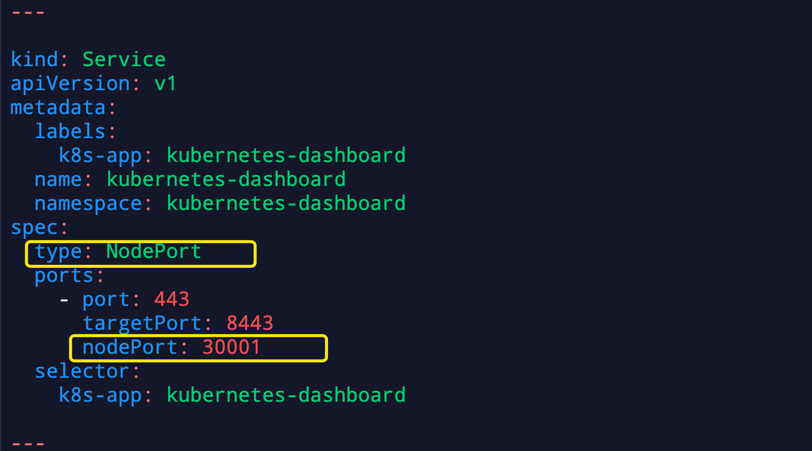
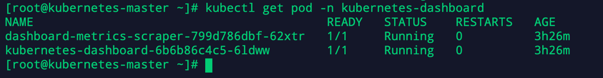
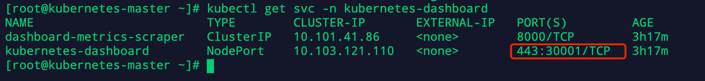
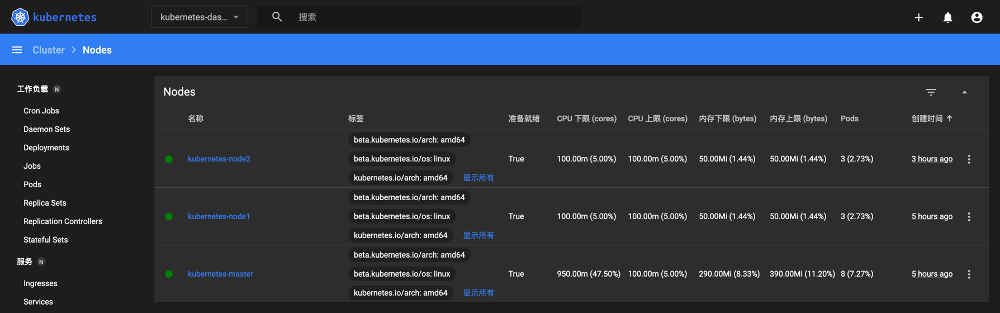

**一、下载Dashboard**

    1、下载dashboard
    wget https://raw.githubusercontent.com/kubernetes/dashboard/v2.4.0/aio/deploy/recommended.yaml

    2、修改dashboard配置
    
    kind: Service
    apiVersion: v1
    metadata:
      labels:
        k8s-app: kubernetes-dashboard
      name: kubernetes-dashboard
      namespace: kubernetes-dashboard
    spec:
    type: NodePort ## 添加
    ports:
      - port: 443
        targetPort: 8443
        nodePort: 30001 ## 添加
    selector:
      k8s-app: kubernetes-dashboard

    3、执行创建服务
    kubectl apply -f recommended.yaml

    4、查看执行结果
    kubectl get pod -n kubernetes-dashboard
    

    kubectl get svc -n kubernetes-dashboard
    

    5、访问Dashboard[Chrome安全限制可以换成Firefox]
    https://masterIP:30001

    6、获取Token方式登陆
    kubectl create serviceaccount dashboard-admin -n kube-system
    kubectl create clusterrolebinding dashboard-admin --clusterrole=cluster-admin --serviceaccount=kube-system:dashboard-admin
    kubectl describe secrets -n kube-system $(kubectl -n kube-system get secret | awk '/dashboard-admin/{print $1}')
    